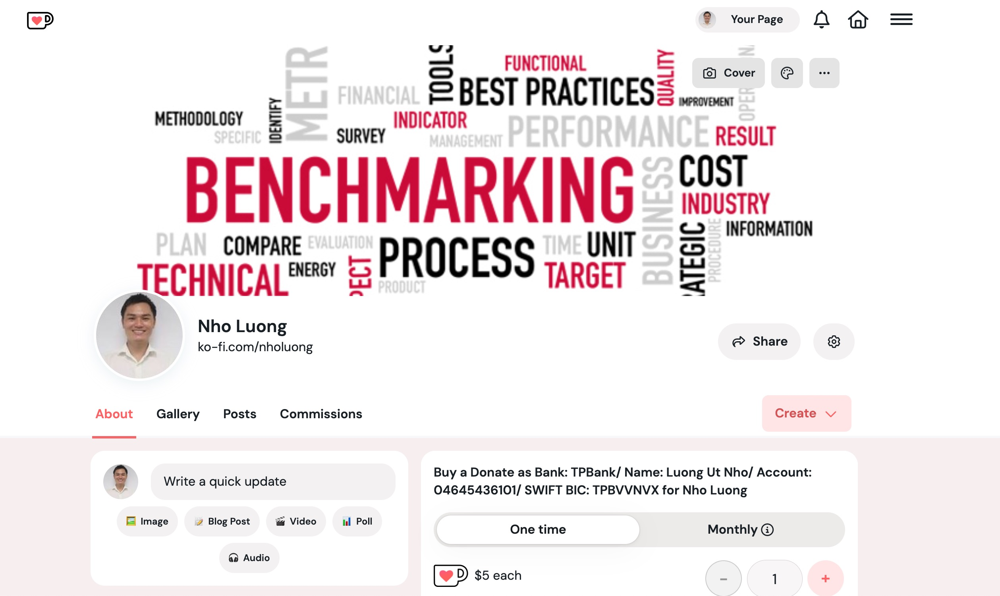

# validate-commit-msg


### [View all Roadmaps](https://github.com/nholuongut/all-roadmaps) &nbsp;&middot;&nbsp; [Best Practices](https://github.com/nholuongut/all-roadmaps/blob/main/public/best-practices/) &nbsp;&middot;&nbsp; [Questions](https://www.linkedin.com/in/nholuong/)
<br/>

[![Build Status][build-badge]][build]
[![Code Coverage][coverage-badge]][coverage]
[![Dependencies][dependencyci-badge]][dependencyci]
[![version][version-badge]][package]
[![downloads][downloads-badge]][npm-stat]
[![MIT License][license-badge]][LICENSE]

[](#contributors)
[![PRs Welcome][prs-badge]][prs]
[![Donate][donate-badge]][donate]
[![Code of Conduct][coc-badge]][coc]

[![Watch on GitHub][github-watch-badge]][github-watch]
[![Star on GitHub][github-star-badge]][github-star]
[![Tweet][twitter-badge]][twitter]

This provides you a binary that you can use as a githook to validate the commit message. I recommend
[husky](http://npm.im/husky). You'll want to make this part of the `commit-msg` githook, e.g. when using [husky](http://npm.im/husky), add `"commitmsg": "validate-commit-msg"` to your [npm scripts](https://docs.npmjs.com/misc/scripts) in `package.json`.

Validates that your commit message follows this format:

```
<type>(<scope>): <subject>
```

Or without optional scope:

```
<type>: <subject>
```

## Installation

This module is distributed via [npm](https://www.npmjs.com/) which is bundled with [node](https://nodejs.org/) and
should be installed as one of your project's `devDependencies`:

```
npm install --save-dev validate-commit-msg
```

## Usage

### options

You can specify options in `.vcmrc`.
It must be valid JSON file.
The default configuration object is:

```json
{
  "types": ["feat", "fix", "docs", "style", "refactor", "perf", "test", "build", "ci", "chore", "revert"],
  "scope": {
    "required": false,
    "allowed": ["*"],
    "validate": false,
    "multiple": false
  },
  "warnOnFail": false,
  "maxSubjectLength": 100,
  "subjectPattern": ".+",
  "subjectPatternErrorMsg": "subject does not match subject pattern!",
  "helpMessage": "",
  "autoFix": false
}
```

Alternatively, options can be specified in `package.json`:

```json
{
  "config": {
    "validate-commit-msg": {
      /* your config here */
    }
  }
}
```

`.vcmrc` has precedence, if it does not exist, then `package.json` will be used.

#### types

These are the types that are allowed for your commit message. If omitted, the value is what is shown above.

You can also specify: `"types": "*"` to indicate that you don't wish to validate types.

Or you can specify the name of a module that exports types according to the
[conventional-commit-types](https://github.com/nholuongut/conventional-commit-types)
spec, e.g. `"types": "conventional-commit-types"`.

#### scope

This object defines scope requirements for the commit message. Possible properties are:

##### required

A boolean to define whether a scope is required for all commit messages.

##### allowed

An array of scopes that are allowed for your commit message.

You may also define it as `"*"` which is the default to allow any scope names.

##### validate

A boolean to define whether or not to validate the scope(s) provided.

##### multiple

A boolean to define whether or not to allow multiple scopes.

#### warnOnFail

If this is set to `true` errors will be logged to the console, however the commit will still pass.

#### maxSubjectLength

This will control the maximum length of the subject.

#### subjectPattern

Optional, accepts a RegExp to match the commit message subject against.

#### subjectPatternErrorMsg

If `subjectPattern` is provided, this message will be displayed if the commit message subject does not match the pattern.

#### helpMessage

If provided, the helpMessage string is displayed when a commit message is not valid. This allows projects to provide a better developer experience for new contributors.

The `helpMessage` also supports interpolating a single `%s` with the original commit message.

#### autoFix

If this is set to `true`, type will be auto fixed to all lowercase, subject first letter will be lowercased, and the commit will pass (assuming there's nothing else wrong with it).

### Node

Through node you can use as follows

```javascript
var validateMessage = require('validate-commit-msg');

var valid = validateMessage('chore(index): an example commit message');

// valid = true
```

### CI

You can use your CI to validate your _last_ commit message:

```
validate-commit-msg "$(git log -1 --pretty=%B)"
```

_Note_ this will only validate the last commit message, not all messages in a pull request.

### Monorepo

If your lerna repo looks something like this:

```
my-lerna-repo/
  package.json
  packages/
    package-1/
      package.json
    package-2/
      package.json
```

The scope of your commit message should be one (or more) of the packages:

EG:

```json
{
  "config": {
    "validate-commit-msg": {
      "scope": {
        "required": true,
        "allowed": ["package-1", "package-2"],
        "validate": true,
        "multiple": true
      },
    }
  }
}
```

# 🚀 I'm are always open to your feedback.  Please contact as bellow information:
### [Contact ]
* [Name: nho Luong]
* [Skype](luongutnho_skype)
* [Github](https://github.com/nholuongut/)
* [Linkedin](https://www.linkedin.com/in/nholuong/)
* [Email Address](luongutnho@hotmail.com)



[](https://ko-fi.com/nholuong)

# License
* Nho Luong (c). All Rights Reserved.🌟